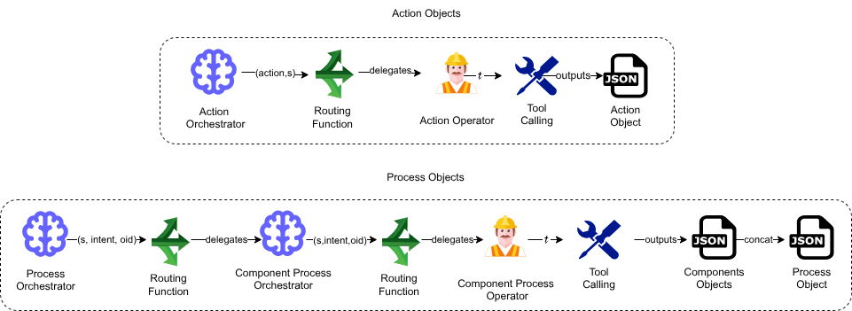

# Easy4all: Multi-Agent System for JSON Schema Enforcement



## Overview

This Multi-Agent System (MAS) generates schema-compliant JSON specifications from natural language for a no-code Human Resource (HR) application. The system addresses two key challenges: strict schema enforcement and cognitive load from long JSON contexts.

Our approach employs a 20B-parameter Small Language Model (GPT-OSS), post-trained to reason over tool calls, with hierarchical orchestration that decomposes tasks across specialized agents. Unlike approaches using expensive proprietary LLMs or constrained decoding that degrades reasoning, our system uses task decomposition to enable cost-effective schema enforcement.

The system produces two types of objects:
- **Action objects**: Application procedures (e.g., update database entries)
- **Process objects**: Multi-component visual interfaces (e.g., custom tables and forms)

The hierarchical architecture consists of orchestrator agents and operational agents working across two levels:
- For Action objects: A single orchestration level routes requests to specialized operational agents
- For Process objects: An additional orchestration level handles the complexity of multi-component interfaces, with intermediate orchestrators managing different component types

This architecture minimizes cognitive load on the language model through routing functions, enabling the system to handle complex multi-component requests while maintaining schema fidelity.

Contact the authors for a live demonstration using the examples in this repository.


## Demo Video

[Demo Video](http://youtube.com/watch?v=ZoDBiHAG_Mc)

## Citation

Coming soon
```
